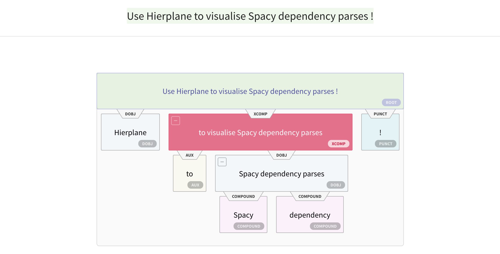

## Spacy Dependency Parse Visualisation

<p align="center"></p>


## Building and running the demo

First, make sure you have a relatively new version of `npm` installed on your
system.  If you are on a Mac, you can install `npm` with `brew install node`.

```
# npm -v
5.3.0
```

Next, you will need to install the dependencies specified in `package.json`.
You only need to run this once, or whenever dependencies are updated.  This
will install your dependencies into the newly created `node_modules` subfolder.

```
npm install
```

Now you can build the application.

```
npm run build
```

Now to run the demo, run the following.

```
python displacy/app.py
```

You may need to force refresh your web browser.

If you are developing the Javascript, then you will want to run that portion
through npm itself.  This way the browser will refresh after each code change.

```
npm start
```
