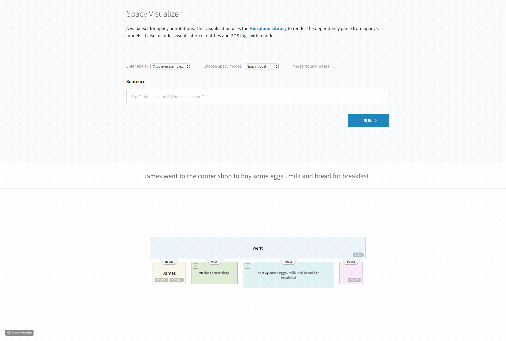

## Visualise Spacy Models with Hierplane!

## Building and running the demo

To run the demo using Docker, run:
```
docker run -p 8080:8080 -p 3000:3000  -it spacy-vis bash bin/serve
```

<p align="center"></p>

## Installing and running locally
First, make sure you have a relatively new version of `npm` installed on your
system.  If you are on a Mac, you can install `npm` with `brew install node`.

```
# npm -v
5.3.0
```

Next, you will need to install the dependencies specified in `package.json`.
You only need to run this once, or whenever dependencies are updated.  This
will install your dependencies into the newly created `node_modules` subfolder.

```
cd demo
npm install
npm run build
cd ..
```

Finally you will need to install the python requirements(the server requires python 3.6):

```
pip install -r displacy/requirements.txt
```

Now to run the demo, run the following.

```
bash bin/serve
```

You may need to force refresh your web browser.

If you are developing the Javascript, then you will want to run that portion
through npm itself.  This way the browser will refresh after each code change.

```
npm start
```
